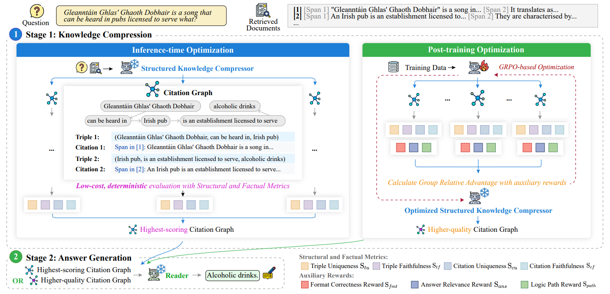

# KZip

This repo contains the code for `Large Language Models as Structured Knowledge Compressors: Enhancing Multi-hop Reasoning with Citation Graphs`

## 📄 Overview
Large Language Models (LLMs) exhibit strong reasoning capabilities but struggle with multi-hop tasks where evidence is scattered across documents. Existing methods either structure the reasoning process into free-form steps that resist rigorous evaluation, or structure the corpus into global knowledge graphs at substantial pre-construction and traversal cost. To bridge this gap, we propose KZip, a two-stage framework that re-frames LLMs as structured knowledge compressors. KZip first distills documents into a citation graph of query-relevant triples grounded in source spans, then generates the answer from this citation graph. We further introduce structural and factual metrics that assess the citation graph in a low-overhead and deterministic manner, guiding both a plug-and-play inference-time optimization and a GRPO-based post-training optimization. Experiments on three multi-hop benchmarks across LLM scales show consistent gains, with KZip improving Exact Match over the Full Context baseline by an average of 8.78% on MuSiQue while reducing context length by 90.03%.

<div align=center></div>


## ⚙️ Quick Start

```bash
pip install -r requirements.txt
```

You need an **OpenAI-compatible** model endpoint. The easiest is a local vLLM
server:

```bash
vllm serve Qwen/Qwen3-4B --port 8000
```

Configure the client via flags or environment variables:

| Variable        | Default                      |
|-----------------|------------------------------|
| `KZIP_BASE_URL` | `http://localhost:8000/v1`   |
| `KZIP_API_KEY`  | `EMPTY`                      |
| `KZIP_MODEL`    | `Qwen3-4B`                   |

Run **KZip** with the following commands:

```bash
# greedy compression on the bundled 5-question example set
python run.py

# draw 5 candidate graphs per question and select the best by reward
python run.py --num-samples 5

# your own data / model
python run.py --data data/example.jsonl --model Qwen3-4B \
    --base-url http://localhost:8000/v1 --out preds.jsonl
```

## 📜 Citation

Available soon.
